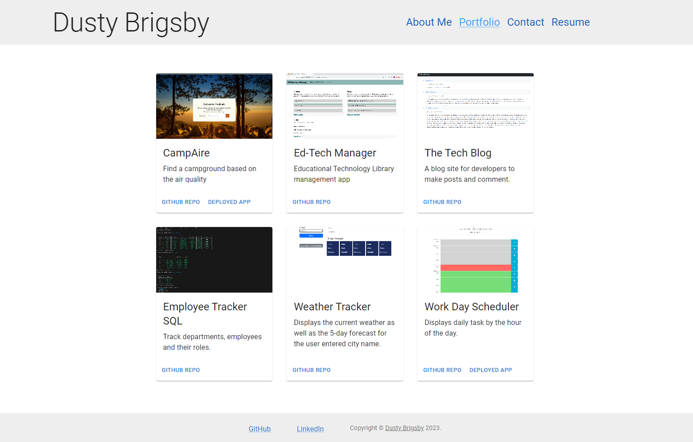

# React-Portfolio

EdX Coding Bootcamp - Module 20 - React Challenge

## Table of Contents

- [Description](#description)
- [Installation](#installation)
- [Usage](#usage)
- [Screenshot](#screenshot)
- [License](#license)
- [Contributors](#contributors)
- [Test](#test)
- [Questions](#questions)

## Description

EdX/University of Oregon Coding Bootcamp Challenge:
Create a portfolio using your new React skills, which will help set you apart from other developers whose portfolios don’t use the latest technologies.

## Installation

- [NodeJS v16.18.0](https://nodejs.org/dist/v16.18.0/node-v16.18.0-x64.msi)
- [webpack](https://www.npmjs.com/package/webpack)
- [Material UI](https://mui.com/material-ui/getting-started/)
- [CodeMirror Themes](https://www.npmjs.com/package/code-mirror-themes)

While in the root directory of the application, enter "npm install" into the terminal.

## Usage

<!-- Usage details -->

## Screenshot

## License

MIT License
See [LICENSE](/LICENSE) file in contatining directory

## Contributors

Used the references and tutorials from:

- Multiple activities from 20-React class lessons, zoom recordings and files.
-
- [MDN Web Docs: Javascript](https://developer.mozilla.org/en-US/docs/Web/JavaScript)
- [MDN Web Docs: Fetch API](https://developer.mozilla.org/en-US/docs/Web/API/Request)
- [W3 Schools](https://www.w3schools.com/mysql/default.asp)

## Test

N/A

## Questions?

[GitHub Repository](https://github.com/dustybrigsby/React-Portfolio)

If not found there, you can email me at:

[dustybrigsby@gmail.com](mailto:dustybrigsby@gmail.com)
